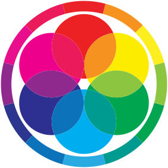
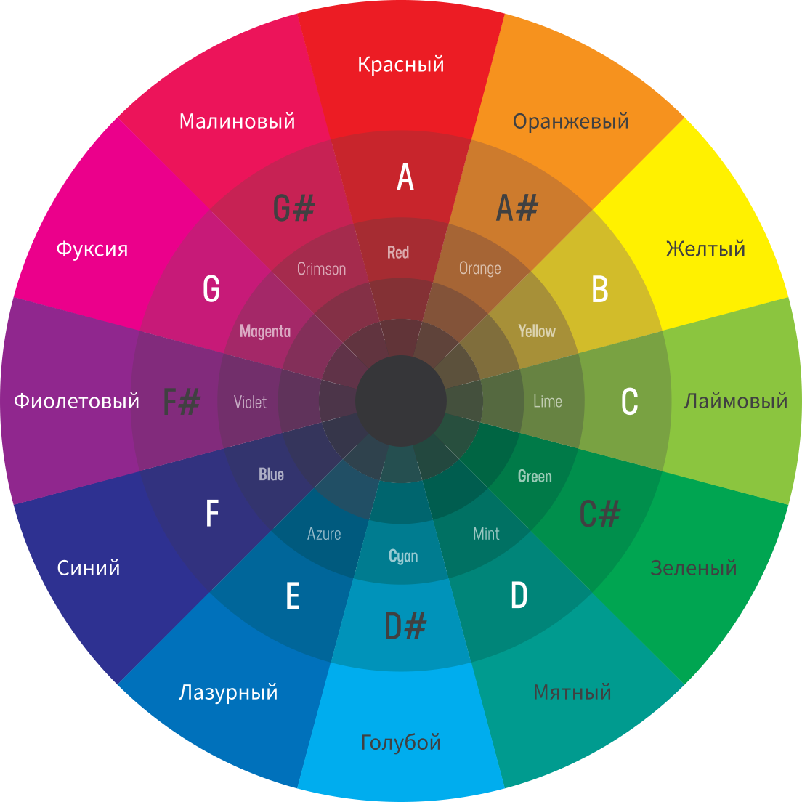

## Цветовой круг 
Это двухмерное отбражение цветового пространства — срез трехмерного.
    1.  Круг Итана - RYB
    2.  Мы используем более современную версию
## Цветовые гармонии 

    1.  Аналоговая
    2.  Комлпементарная
    3.  Раздельно-комплементарная
    4.  Триадическая
    5.  Прямоугольная
    6.  Квадратная
	
##  12 базовых цветов

1.  Первичные — Голубой, Маджента и Желтый
2.  Вторичные — Красный, Зеленый, Синий
3.  Третичные — Оранжевый, Лаймовый, Мятный, Лазурный, Фиолетовый, Малиновый

## Значения цветов
1.  **Красный** — кровь — страсть, гнев, агрессия, опасность,
2.  **Оранжевый** — огонь — энергия, жизненная сила, интерес,
3.  **Желтый** — солнце — свет, счастье, надежда, + обман, разлука, нестабильность
4.  **Лаймовый** — трава — молодость, хитрость, гибкость
5.  **Зеленый** — листва — изобилие, природа, новые начинания, безопасность
6.  **Мятный** — хвоя — весна, таяние, свежесть,
7.  **Голубой** — небо — ясность, прозрачность, легкость,
8.  **Лазурный** — море — доверие, лояльность, уверенность,
9.  **Синий** — океан — глубина, сила, спокойствие
10.  **Фиолетовый** — дух — загадка, воображение, таинственность,
11.  **Пурпурный** — король — богатство, власть, справедливость, честь,
12.  **Малиновый** — сладость — женственность, интуиция, спонтанность, нежность

###  тест по Люшеру:
1.  Первый выбор в тесте Люшера характеризует желаемое состояние, второй — действительное. В зависимости от цели исследования можно интерпретировать результаты соответствующего тестирования».
	1.  1-я позиция отражает средства достижения цели (например, выбор синего цвета говорит о намерении действовать спокойно, без излишнего напряжения);
	2.  2-я позиция показывает цель, к которой стремится испытуемый;
	3.  3-я и 4-я позиции характеризуют предпочтение цвету и отражают ощущение испытуемым истинной ситуации, в которой он находится, или же образ действий, который ему подсказывает ситуация;
	4.  5-я и 6-я позиции характеризуют безразличие к цвету, нейтральное к нему отношение. Они как бы свидетельствуют, что испытуемый не связывает свое состояние, настроение, мотивы с данными цветами. Однако в определенной ситуации эта позиция может содержать резервную трактовку цвета, например, синий цвет (цвет покоя) откладывается временно как неподходящий в данной ситуации;
	5.  7-я и 8-я позиции характеризуют негативное отношение к цвету, стремление подавить какую-либо потребность, мотив, настроение, отражаемые данным цветом.
2.  Основные цвета:
	1.  синий — символизирует спокойствие, удовлетворенность;
	2.  сине-зеленый — чувство уверенности, настойчивость, иногда упрямство;
	3.  оранжево-красный — символизирует силу волевого усилия, агрессивность, наступательные тенденции, возбуждение;
	4.  светло-желтый — активность, стремление к общению, экспансивность, веселость
3.  Дополнительные цвета: 5) фиолетовый; 6) коричневый, 7) черный, 8) нулевой(0). Символизируют негативные тенденции: тревожность, стресс, переживание страха, огорчения.
4.  Основные цвета, по мнению Макса Люшера, символизируют следующие психологические потребности:
	1.  № 1 (синий) — потребность в удовлетворении, спокойствии, устойчивой положительной привязанности;
	2.  № 2 (зеленый) — потребность в самоутверждении;
	3.  № 3 (красный) — потребность активно действовать и добиваться успеха;
	4.  № 4 (желтый) — потребность в перспективе, надеждах на лучшее, мечтах.