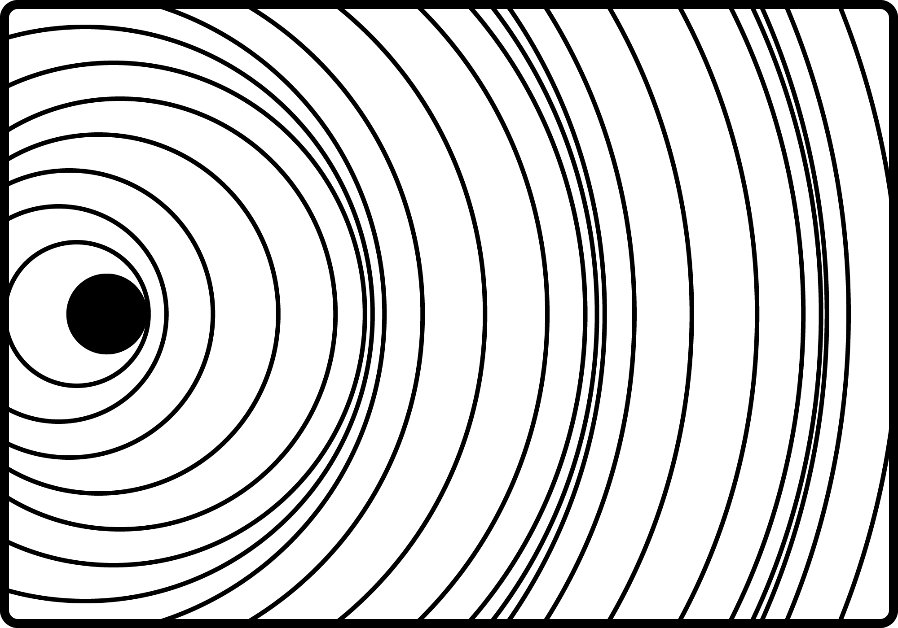
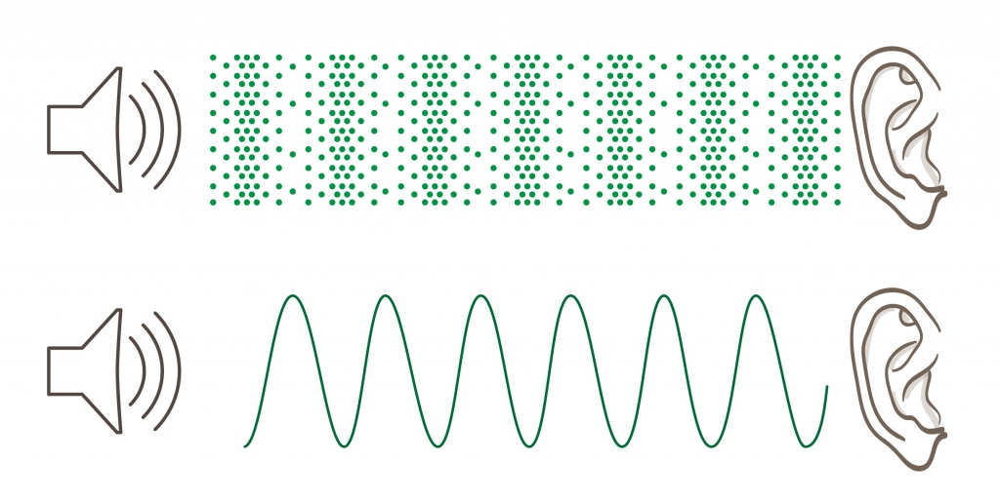

##  Что такое звук
Акустические колебания как распространение упругих волн переменного давления в среде

##  Ряд уплотнений и разряжений среды.

сама среда не смещается, только проводит волну

##  Волновые эффекты:
1.  Поглощение
    1.  выше частота - выше поглощение
    2.  трение молекул, превращение в тепло
2.  Рассеяние
3.  Отражение
4.  Дифракция (огибание волнами препятствий)
5.  Рефракция — отклонение траектории волны (луча) в неоднородной среде.
6.  Интерференция
    1.  Биения
    2.  фаза
    3.  подавление шума

##  Характеристики:
1.  амплитуда - громкость
    1.  Абс. шкала — Громкость в 1 сон — это громкость непрерывного чистого синусоидального тона частотой 1 кГц, создающего звуковое давление 20 мкПа, примерно соотв. минимальному порогу слышимости
    2.  Отн. шкала — Фоны
    3.  Децибе́л (русское обозначение: дБ; международное: dB) — дольная единица, равная одной десятой единицы бел.
        1.  В основе единицы лежит десятичный логарифм.
        2.  Единица названа в честь американского учёного Александра Белла
        3.  Отсюда следует, что увеличение энергетической величины на 1 дБ означает её увеличение в 100,1 ≈ 1,259 раза.
        4.  Использование децибелов при указании громкости звука обусловлено человеческой способностью воспринимать звук в очень большом диапазоне изменений его интенсивности. Применение линейной шкалы оказывается практически неудобным. Кроме того, на основании закона Вебера — Фехнера, ощущение громкости звука пропорционально логарифму его интенсивности. Отсюда удобство логарифмической шкалы. Диапазон величин звукового давления от минимального порога слышимости звука человеком (20 мкПа) до максимального, вызывающего болевые ощущения, составляет примерно 120 дБ.
2.  частота - высота звука - Герцы - колебаний в секунду

## Диапазоны:
1.  инфразвук: 0—16 Гц
    1.  сейсмические волны
    2.  не слышим мы
    3.  издают киты, слоны, бегемоты, крокодилы,
2.  слышимый звук: 16—20000 Гц
    1.  логарифмическое восприятие
    2.  середина - около 5000 Гц
3.  ультразвук: 20кГц—1ГГц
    1.  больше похож на луч
    2.  сканирование узи
    3.  сонар - эхолокация (эхолот)
    4.  издают
        1.  щелчки дельфинов лобным бугром и улавливают нижней челюстью,
        2.  летучие мыши, и слышат насекомые
4.  гиперзвук: от 1ГГц
    1.  в воздухе короче длины свободного пробега
    2.  Щелчки в жидкостях и твердых телах с помощью свч излучения
    3.  фононы
    4.  тепло как сумма гиперзвуковых колебаний - тепловые фононы

##  Скорость звука
зависит от плотности среды (в газе — от массы молекул)

### В газе
В воздухе ~ 343 м/с при 25°С (332 при 0°С)
1.  к первой половине XVII в. Ф. Бэкон в «Новом органоне» указал на возможность определения скорости звука путём сравнения промежутков времени между вспышкой света и звуком выстрела.
2.  гром и молния
3.  звук самолета
4.  зависит от температуры
5.  Как меняется с высотой

### В жидкости
в воде ~ 1400-1500 м/с
1.  колокол и порох на лодках в 14 км
2.  На глубинах около 1 км в результате рефракции на слоях, где давление растет быстрее, чем опускается температура, образуется канал SOFAR (сокращение от Sound Fixing and Ranging channel ) или глубокий звуковой канал (DSC ), представляет собой горизонтальный слой воды в океане, на глубине которого скорость звука минимальна. Канал SOFAR действует как волновод для звука, и низкочастотные звуковые волны внутри канала могут пройти тысячи миль, прежде чем рассеяться.

### В твердом теле
в стали ~ 5000 м/с
1.  продольные и поперечные волны.
2.  Продольные быстрее
3.  в граните ~ 4000 м/с

##  Длина волны
1.  длина = скорость / частота
2.  16 Гц - 21 м
3.  1 кГц - 34 см
4.  10 кГц - 3.4 см

##  Резонанс
1.  Резонансная частота
2.  Расчет резонансных частот помещения