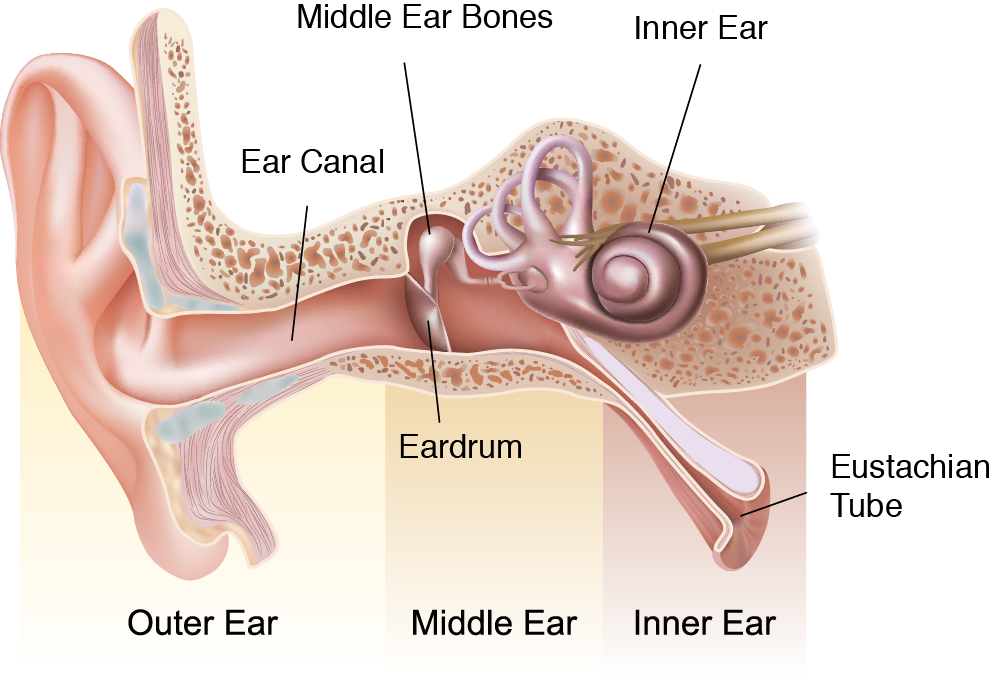
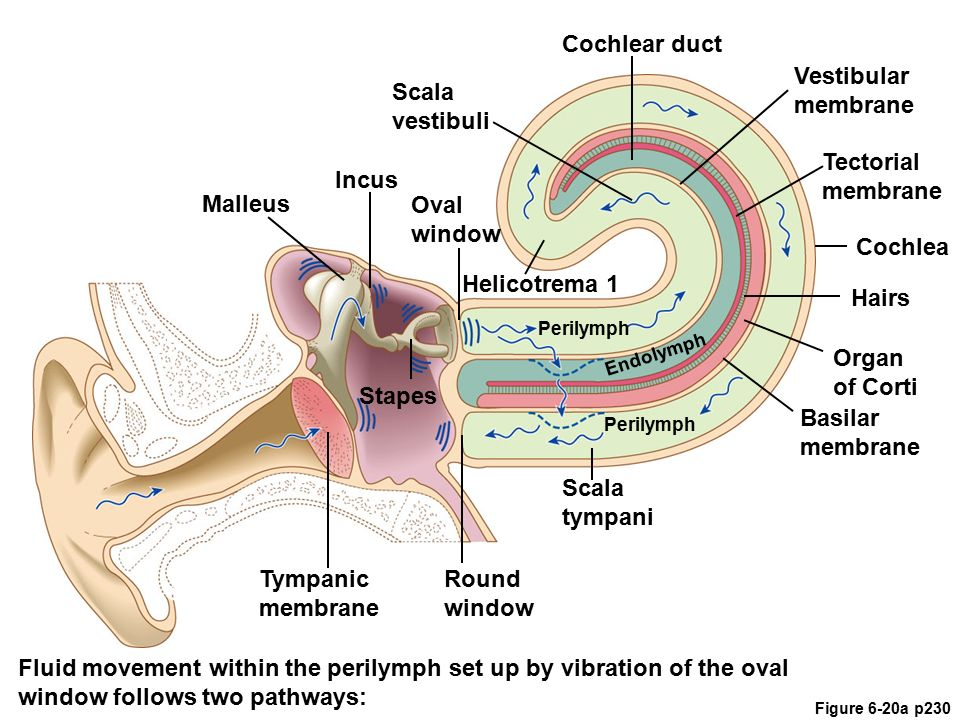
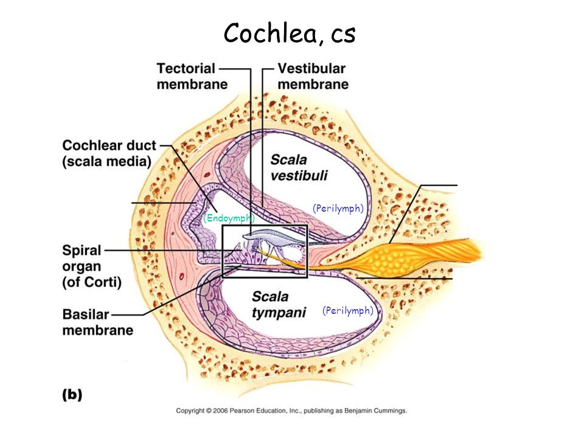
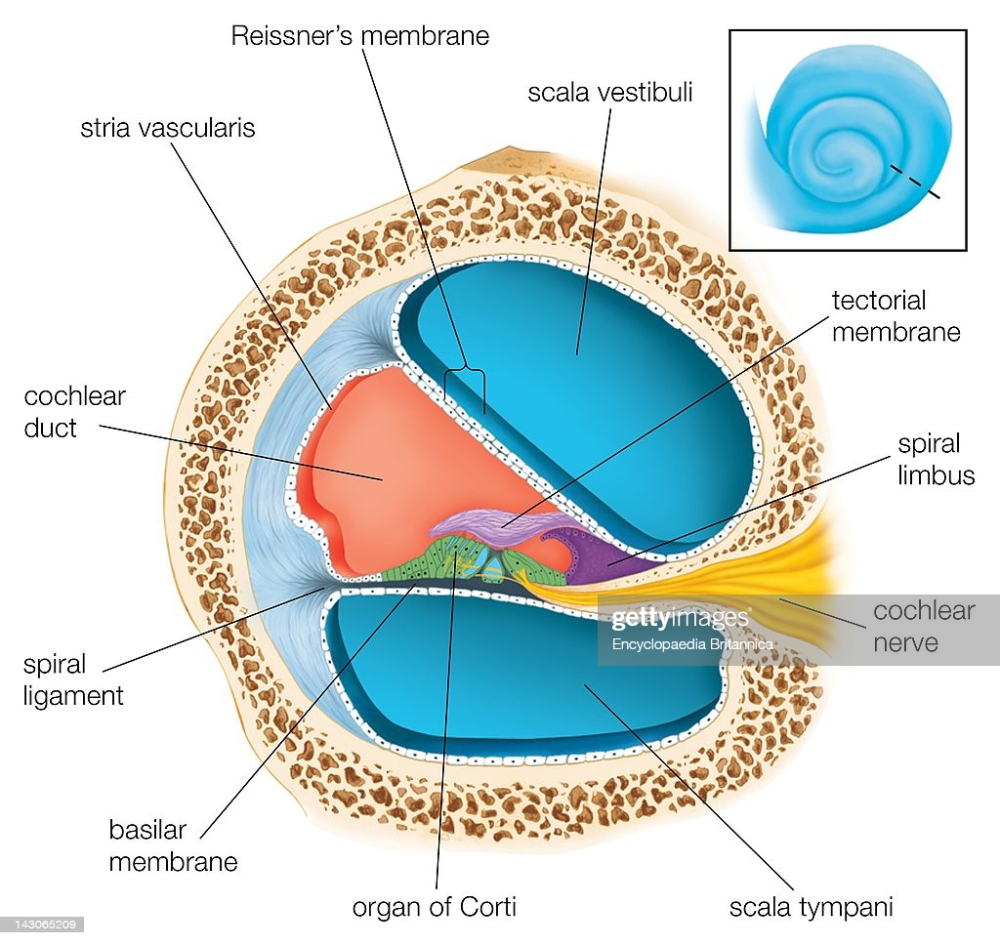

##  Строение слуховой системы

###  Наружное ухо
1.  Ушная раковина
    1.  Складки человеческой ушной раковины вносят в поступающий в слуховой проход звук небольшие частотные искажения, зависящие от горизонтальной и вертикальной локализации звука. Таким образом мозг получает дополнительную информацию для уточнения местоположения источника звука.
2.  Височная кость
3.  Слуховой канал

###  Среднее ухо
1.  Барабанная перепонка
2.  Слуховые косточки
    1.  Молоточек
    2.  Наковальня
    3.  Стремечко
    4.  Наличие указанной цепочки позволяет увеличить давление на овальное окошечко в 20 раз по сравнению с давлением на барабанную перепонку
3.  Евстахиева труба

###  Внутреннее ухо
1.  Овальное окно
2.  Полукружные каналы - орган равновесия

###  Улитка

1.  2.5 оборота
2.  костная спиральная пластинка и базилярная мембрана
    1.  тонотопное устройство — разные частоты определяются в разных местах улитки
3.  2 полости - верхняя и нижняя лестницы с перилимфой
4.  улитковый проток с эндолимфой
5.  внутри протока — Кортиев орган с волосковыми клетками

###  Нервы

## Выводы

Таким образом, улитка является механическим измерителем Амплитудно-Частотой Характеристики АЧХ, и по действию схожа с АЧХ-метром (эквалайзер), а не с микрофоном. Это позволяет мозгу получать звук в виде спектра мощности.