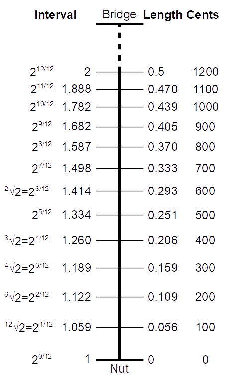
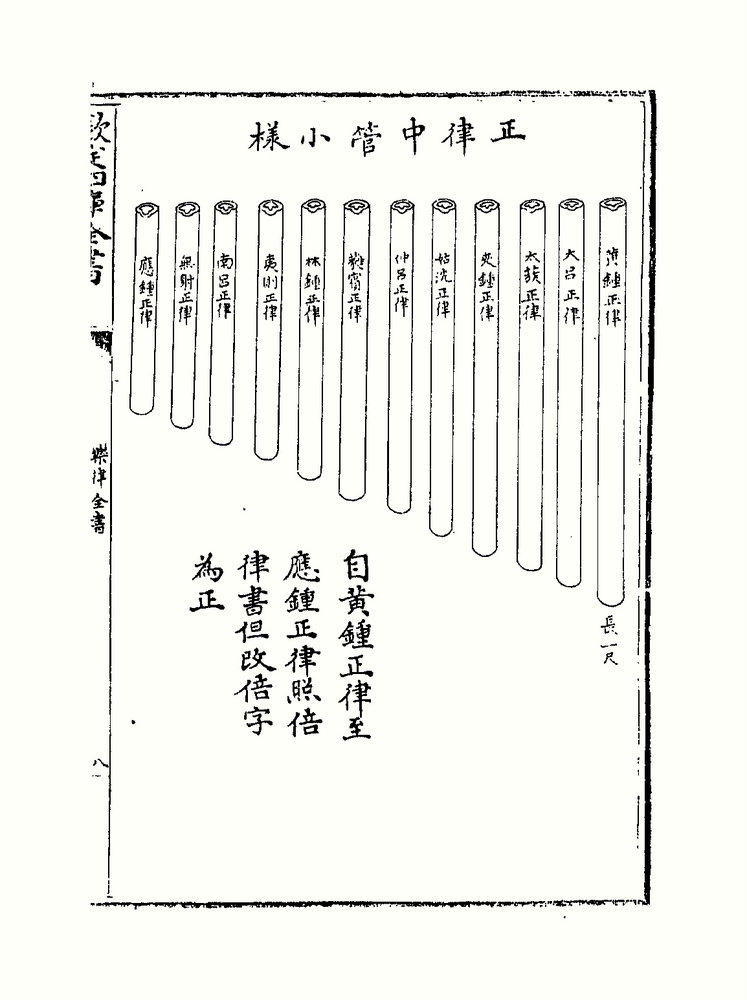
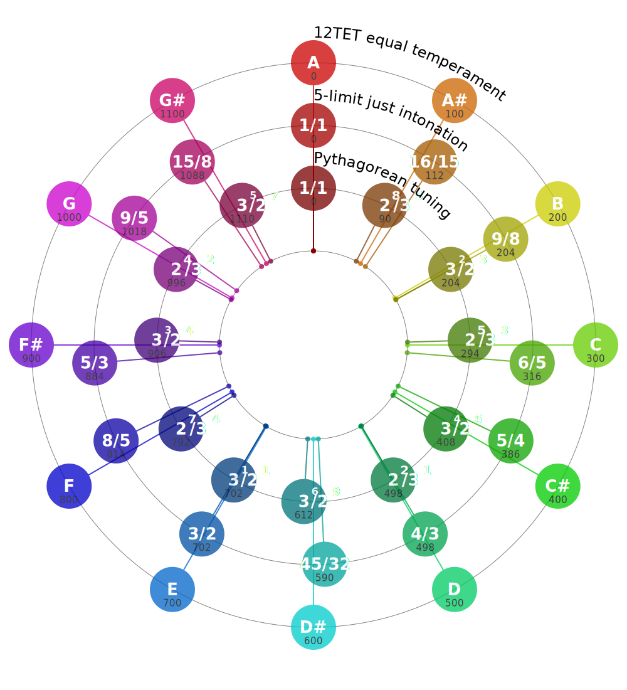

###  Музыка — это математика

##  Эксперименты пифагора
*   Монохорд
    *   деление струны пополам
    *   три к двум
    *   тетраксис 1:2:3

## Чистый строй
*   Соотношения простых чисел
    *   чистый строй (натуральный строй)
        *   основан на гармониках от заданной ноты
        *   целочисленные соотношения частот
        *   привязан к основной ноте

## Среднетоновый строй
*   поправка в шаге для того, чтобы выравнять соотношения ступеней в разных тональностях
*   Цель темперации — независимость частот нот от основной, что дает возможность модуляции и транспонирования.

## Равномерная темперация

иррациональная частота корень 12 степени из двух

Невозможно с достоверностью указать, кто именно «изобрёл» равномерную темперацию. Среди первых теоретиков нового равномерно темперированного строя называют Генриха Грамматеуса (1518), Винченцо Галилея (1581) и Марена Мерсенна. Фламандский математик Симон Стевин в своём труде «О теории певческого искусства» (ок. 1585) дал математически точный расчёт равномерной темперации. Написанная на родном языке Стевина (фламандском) его работа не получила резонанса; посмертная слава пришла к Стевину спустя 300 лет, в 1884 году, когда она была опубликована (и вскоре переведёна на другие языки).

Одним из первых авторов, давших теоретическое обоснование 12-ступенной равномерной темперации, был китайский принц Чжу Цзайюй (朱載堉), в трактате 1584 года.

Попытки преодолеть интонационные недостатки 12-ступенной темперации путём создания строя с 24, 36, 48, 53 и бо́льшим количеством ступеней в октаве не получили распространения. На практике 12-ступенная равномерная темперация и в XXI веке остаётся оптимальной разновидностью темперации.

##  Настройка инструмента

    *   эталон и унисон
    *   тюнер
        *   insTuner iOS
    *   настройка пианино по биениям