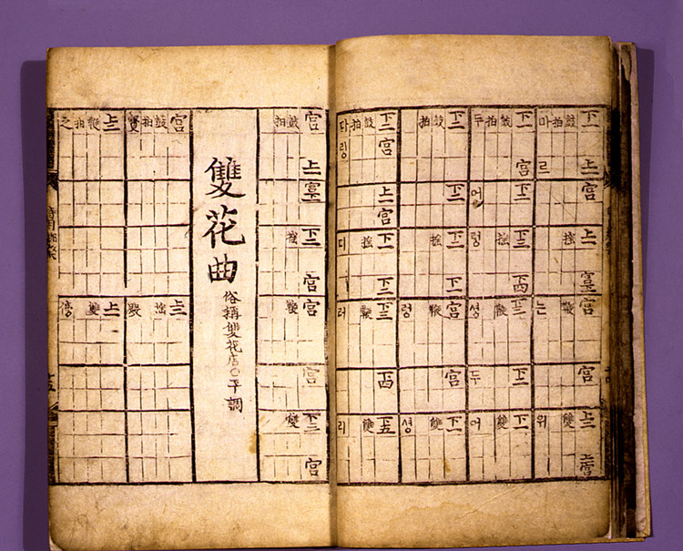

1.  Нота — точка в непрерывном пространстве звуковых частот
2.  Записанная нота обозначает высоту, длительность и порядок исполнения.
3.  в музыке используются наборы из нот - от одной до всех 12
4.  всем известны 7 основных нот:
    1.  как 7 основных цветов радуги
    2.  до, ре, ми, фа, соль, ля, си
    3.  белые клавиши пианино
5.  Одну и ту же ноту можно обозначить разными способами
6.  В равномерной темперации нет черных и белых клавиш, есть 12 делений круга как на часах. Это достижение еще осваивается человечеством.
7.  Но к этому вел долгий путь и это лишь одна среди многообразных музыкальных систем. 
8.  В различных регионах мира независимо возникали свои системы нотации
    1.  Устная традиция — песни и эпос
    2.  Народные пения и выступления - договаривались о нотах
   
## Месопотамия - древнейшие записи инструкций для Хурритских певцов 
 

## Индия
sa re ga ma pa dha ni
 

## Китай
 
 

## Корея - Джонгганбо
 
 

## Япония - Кункунши
   
 

## Древняя Греция 
 