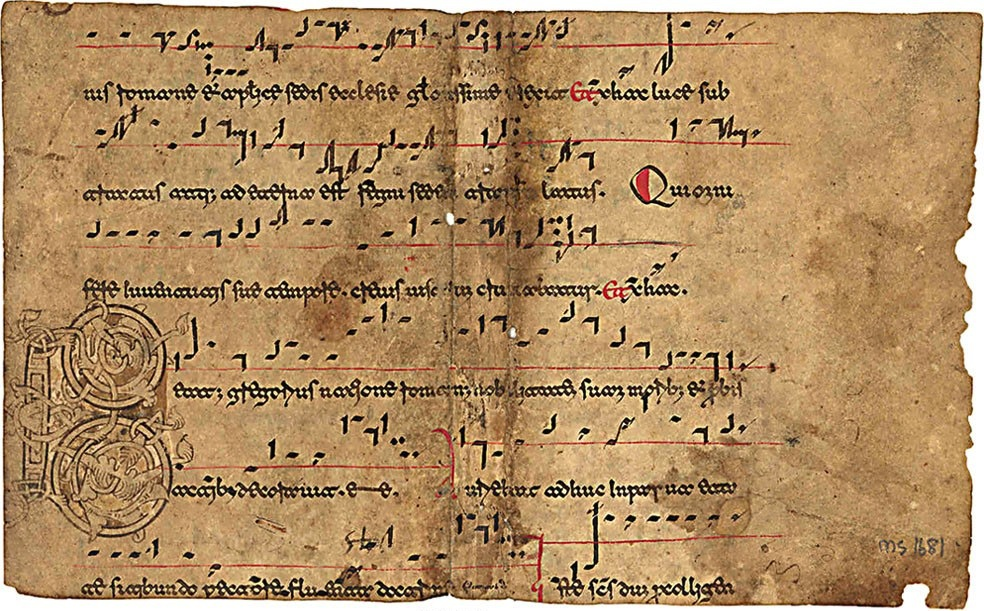
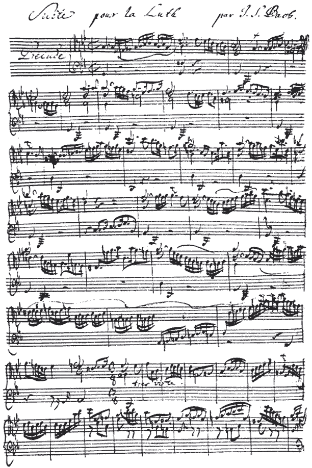
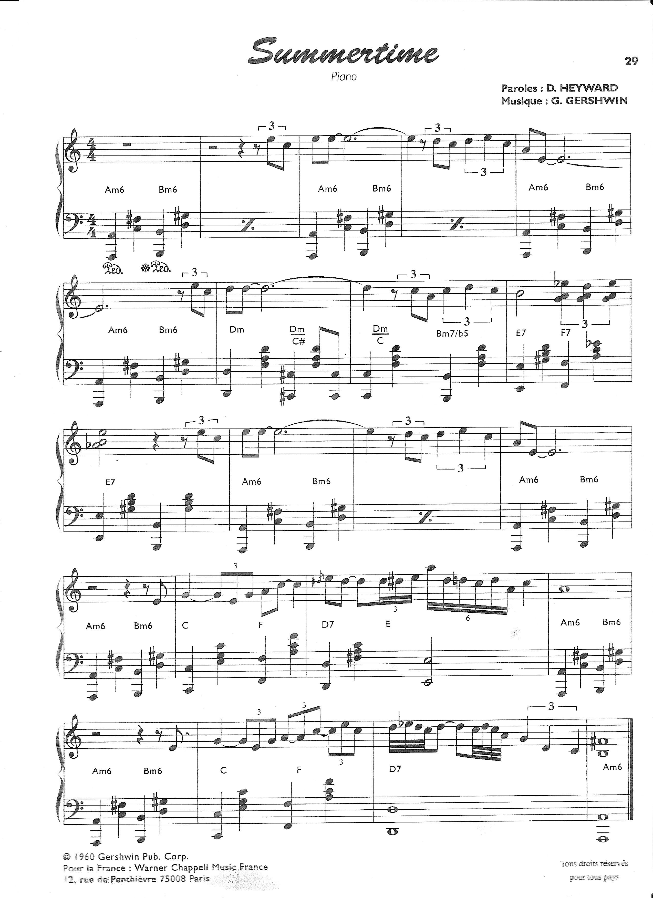
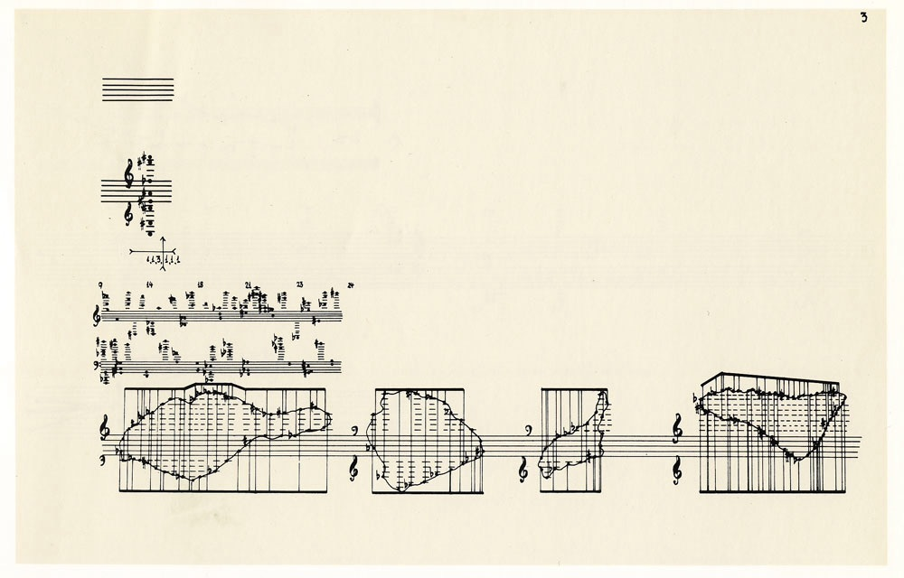
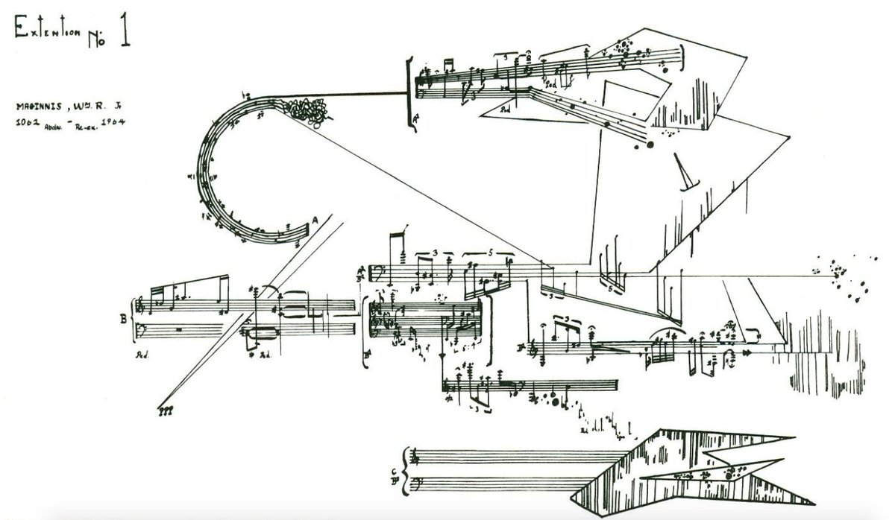

##  Средние века в Европе — невмы
1. В начале играет мелодия  
	 - Dies irae [аудио](./Dies.irae.ogg.mp3)
    - На фоне — вот эта картинка 
3. Потом музыка становится тише и играет какое-то время на фоне голоса, потом стихает совсем
4. Адиастемические распев
    -  
5.  Беневентанский распев
    -  
6.  Григорианское пение
    -[Григорианский распев](./Gradual_chant_-_Universi_qui_te_expectant.ogg.mp3)
4.  Готическая нотация
    -  Образец зрелой готической нотации (Карлсруэ, Landesbibliothek, XIII или XIV в.). Показано начало оффиция на первое воскресенье Адвента: антифон «Ecce nomen Domini», инвитаторий «Regem venturum», антифон «Hora est jam nos de somno surgere» и респонсорий «Aspiciens a longe ecce». В росписи буквицы "A" респонсория изображён папа Григорий Великий с голубем (на плече), символизирующим Дух Святой 
5.  Диастемические невмы
    -   

##  Знаменный распев - крюки и знамена
1.  https://youtu.be/bJkfYaCIcUM
2.  8 нот — глас
3.  Киноварные знаки
4.  Кондакарный распев
    - 
    - 
    - 
    - 
    - 
    - с 17 века - топорики - киевская нотация
        - Евангельская стихира «Мариины слезы» в нотации «топориками» (фрагмент). Из кн.: Октоих нотного пения. 7-е изд. Москва, 1811  

##  Квадратная нотация 1200 гг
- 
- 
- 
- 

##  Мензуральная нотация
- 
- 

##  Гвидо д’Ареццо (Аретинский)
1.  Монах-бенедиктинец
2.  ок. 1000 г н э
3.  Две ключевые линейки — F и C — Гвидо определил как звуковысотные ориентиры, выделяя их на письме, соответственно, красным (точнее суриком) и желтым (точнее шафраном) цветом. Благодаря этому нововведению высота звука (прежде всего, в григорианской монодии, отчасти также в многоголосии) стала нотироваться более точно, чем в невменных рукописях до Гвидо. 
4.  Он также ассимилировал октавную латинскую буквенную нотацию, впервые описанную в анонимных трудах Псевдо-Одо незадолго до Гвидо, в начале XI века (возможно, при его участии). Одинаковые интервальные функции (положение данной ступени звукоряда по отношению к его окружению, другим звукоступеням) Гвидо обозначил одинаковыми латинскими буквами разного начертания — прописными, строчными и сдвоенными — по всему певческому диапазону: 
- 
- ут-ре-ми-фа-сол-ла - относительные ступени гексахорда 

## Гвидонова рука 
- 
- 

##  Нотная грамота

## История академической музыки

### Средневековье 	(476—1400)
- МонОдия
- Антифония — поочередное пение двух хоров
- Чистые интервалы - октава, унисон, квинта
- Терция и секста — диссонансы

### Ренессанс 	(1400—1600)
Полифония - две независимых мелодии - позже развилась в контрапункт

#### Лютня

### Барокко 	(1600—1750)
Барочная музыка стремилась к более высокому уровню эмоциональной наполненности, чем музыка Ренессанса. Сочинения барокко часто описывали какую-то одну, конкретную эмоцию (ликование, печаль, набожность и так далее). Барочная музыка часто писалась для виртуозных певцов и музыкантов и обычно была значительно более сложна для исполнения, чем музыка Ренессанса, несмотря на то, что детальная запись партий для инструментов была одним из самых главных нововведений периода барокко.

####  Иоганн Себастьян Бах

### Классицизм 	(1750—1820)
В эпоху классицизма, которая последовала за барокко, роль контрапункта уменьшилась (хотя развитие искусства контрапункта не прекратилось), и на первое место вышла гомофонная фактура музыкальных произведений.

Соната и симфония для оркестра

Эстетика классицизма основывалась на убеждении в разумности и гармоничности мироустройства, что проявилось во внимании к сбалансированности частей произведения, тщательной отделке деталей, разработке основных канонов музыкальной формы. Именно в этот период окончательно сформировался классический состав частей сонаты и симфонии, а также сонатная форма, основанная на разработке и противопоставлении двух контрастных тем. 

### Романтизм 	(1820—1890)
- Моцарт, Бетховен и Шуберт, в России — Глинка, Мусоргский
- фортепиано
- Симптоматичным для этой эпохи стало появление типа свободного художника — музыканта, не связанного узами светской или церковной службы. Обычно первым из них называют Бетховена (хотя на самом деле первым был Вольфганг Амадей Моцарт, сознательно оставивший пост при зальцбургском дворе и приобретший независимое положение). 

### Шопен
- Nocturne in B major, Op. 62, No. 1 

### Модернизм 	(1890—1930)
- Проверка пределов эстетического конструирования
- Клод Дебюсси, Эрик Сати, Рихард Штраус, Игорь Стравинский, Дмитрий Шостакович, Скрябин
- джаз

#### Эрик Сати

#### Джаз

  
### Постмодерн 	(1930—2000)
Звукозапись
Начиная с конца 1940-х композиторы академического направления, в частности такие, как Эдгар Варез, Пьер Шеффер, Карлхайнц Штокхаузен и Джон Кейдж, создавали композиции, которые существовали исключительно в виде аудиозаписей, используя многоканальную запись, редактируя или варьируя скорость записи звуков, что означало создание музыки, которая не могла быть сыграна традиционными средствами, но могла существовать лишь как запись.

Подобная техника впоследствии пришла и в электронную музыку. Детально разработанные мультитрековые записи многих исполнителей стали очень далеки от того, что музыканты могут реально изобразить на сцене.

В эпоху модернизма популярная музыка рассматривалась как второстепенная по отношению к более «весомым» жанрам. Философия постмодерна, однако, поставила под сомнение правомерность и приемлемость распределения культуры на «высокую» и «низкую».

Третий виток постмодернистской музыки связан с фундаментальной сменой представлений о том, о чём должна быть музыка. С утверждением постмодернизма утверждалась идея, что музыка «сама по себе». Стилевые аллюзии и цитаты стали не только техническим приёмом, но сущностной стороной музыки, переросшей из возможности в потребность. В этом также виден отход от модерновой парадигмы, когда основными элементами музыкального искусства считались интонация, ритм и мотивы; постмодернизм считает основным предметом искусства медиапотоки, промышленные объекты и отдельные жанры. Иными словами, постмодерн сводит роль искусства к комментированию общества потребления и его продуктов, отказываясь от модерного стремления постичь «реальность» вселенной в его фундаментальных формах. 

### XXI век 	(2001 — н. в.) 

## Джаз
- 
- 

## Сериализм и додекафония: Арнольд Шенберг
Сущность шёнберговского метода додекафонии состоит в том, что составляющие данное произведение мелодические голоса и созвучия производятся непосредственно или в конечном счёте из единственного первоисточника — избранной последовательности всех 12 звукостепеней равномерно темперированной (так называемой «хроматической») октавы, трактуемых как единство. Эта последовательность звуков называется серией (фр. série — ряд, нем. Reihe). В методе додекафонии не существует самого понятия благозвучия или неблагозвучия: все 12 тонов октавы используются совершенно равноправно и соотносятся «лишь между собой», образуя в своей серии уникальную последовательность звуков. Серия может быть «горизонтальной» — мелодией и «вертикальной» — созвучием с определённой структурой. 
- 
- Оливье Мессиан, Альфред Шнитке

## Алеаторика
От свободной инструментальной импровизации до ограниченной и контроллируемой алеаторики. При этом различается два способа управления — алеаторика творческого процесса и алеаторика исполнительского и продукционного процесса. В большинстве случаев оба способа комбинируются.

Пример творческой алеаторики по Джону Кейджу: на чистый лист нанесено 4 пары пятилинейных нотоносцев так, что между ними есть расстояние, позволяющее использовать 9 верхних и 6 нижних дополнительных линеек. Ключ на нотоносце определяется произвольно (с помощью подбрасывания монеты). Примерно посередине для правой и левой руки нанесена линия для записи звуков, возникающих от ударов по внутренней и внешней стороне резонатора фортепиано и так далее. 

- ** Открытая **: Термин открытая форма иногда используется для «мобильной» или «поливалентной» музыкальных форм, где порядок частей или секций не определён или остаётся на усмотрение исполнителя. 
-  **Закрытая**: Произведение Терри Райли «In C» (1964) состоит из 53 коротких последовательностей; каждый из исполнителей ансамбля может повторять любую последовательность столько, сколько хочет перед началом следующей, делая каждое исполнение «In C» уникальным, хотя, поскольку общее направление является фиксированным, это — закрытая форма. 

###   Джон Милтон Кейдж
- 
- 
- 

###  Витольд Лютославский
- 