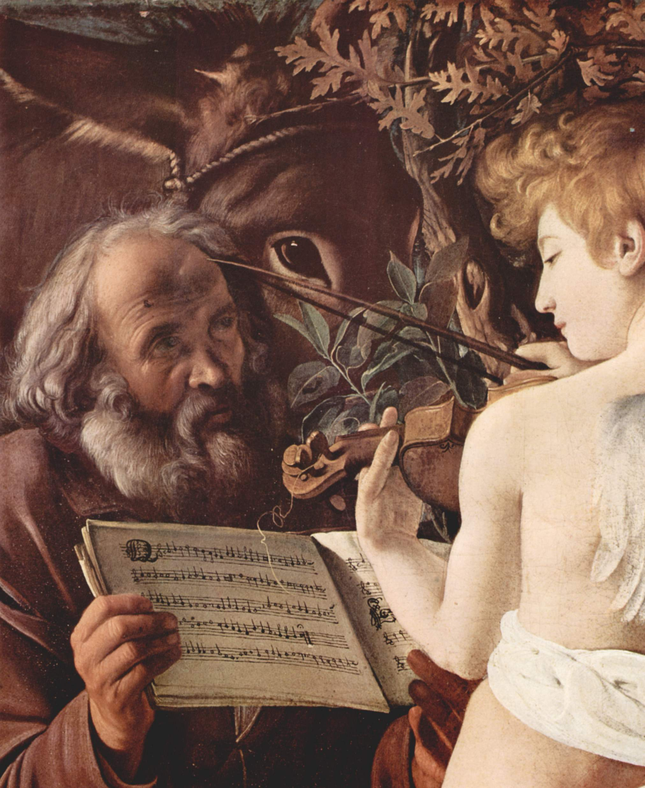

[https://en.wikipedia.org/wiki/Sight-reading](https://en.wikipedia.org/wiki/Sight-reading) - Исполнение А прима — с листа.

1.  Нотный стан
2.  Скрипичный ключ
3.  Басовый ключ
4.  Семь нот
5.  Знаки альтерации
    1.  диез
    2.  бемоль
    3.  бекар
6.  Энгармонизмы
7.  Всего нот не 7, а 12