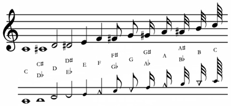
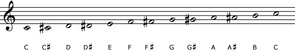
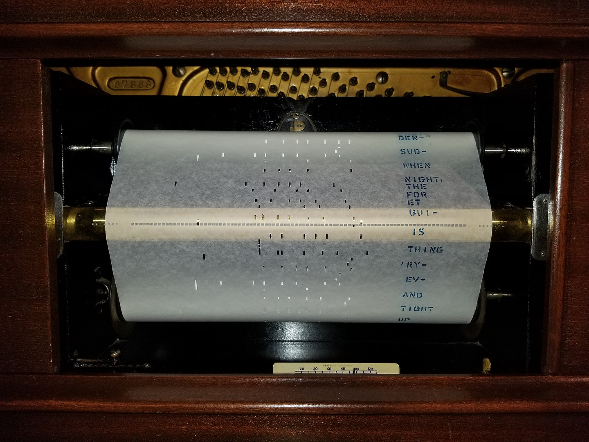
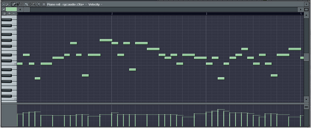

### Буквенные обозначения
Гвидо Аретинский

## Билинейная нотация

## Хроматический стан

##  Цифрованая нотация

 XVII век францисканский монах Жан-Жак Суэтти
Жан Жак Руссо в брошюре  «Диссертация о современной музыке» (1743) 
В первой половине XIX века усилиями Пьера Галена, Эмиля Шеве и Эме Пари. По фамилиям авторов она стала называться «нотацией Га-Па-Ше» (Гален-Пари-Шеве)

«Нотация Га-Па-Ше» опиралась на три те-  
зиса:
1. ступени мажора обозначались 1, 2, 3, 4, 5, 6, 7; ступени минора — 6, 7, 1, 2, 3, 4, 5;
2. повышенные и пониженные ступени обозна-чались перечеркнутыми цифрами, например, 2\ и 2/;
3. тональность обозначалась особой пометкой в начале записи, например, «тон Фа» означало «тональность Фа мажор».
 
 подготовила появление относительной системы сольмизации 
 В XIX веке широко рас-пространилась в Европе
 Интересно, что с 1860-х годов сольфеджио на основе «Га-Па-Ше» активно применялась в петербургской Бесплатной музыкальной школе и Бесплатных хоровых классах Московского отделения РМО.
Школьные песенники и методические руководства издавались как в пятилинейной нотации, так и в цифровой.
 
 По мере распространения в Европе печатных нот значение цифровой нотации снижалось, и концу XIX века сошло на нет. В тот же период интерес к цифровой системе возник в странах Дальнего Востока, желавших быстро войти в мировой культурный, в том числе и музыкальный, процесс. 
 
 Цзян пу - упрощенная нотация

##  Табулатура

##  ABC-нотация

## Клаварскрибо  
- 
- 
## Додека
- 
- 
##  Код Парсонса
[Код Парсонса](./ParsonsCode-Ode_to_Joy.png)

##  Piano roll
   
   

##  [MIDI](./midi-notes.jpg)
