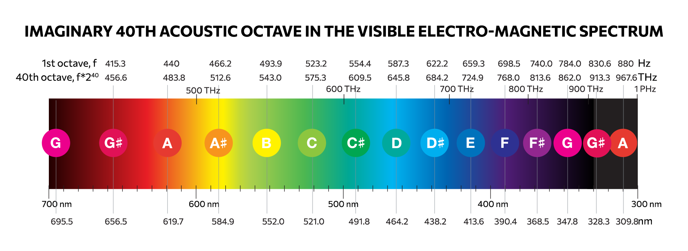
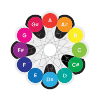

*   Начало - личное исследование
*   Название
*   Синестезия
    *   Эксперименты
*   Простая формула
    *   12 хроматических нот октавы
    *   12 базовых тонов цветового круга
    *   Сопоставить спектр цвета и диапазон октавы
*   Научное обоснование
    *   Ля — первая нота, A - первая буква **3:50** 
    *   Красный — первый цвет
    *   40-ая октава **4:05**  
*   Круг нот **4:38** 
*   Наклейки, памятки,
*   технология, язык
*   Сайт, Веб-приложения **6:00** 
*   Сообщество
*   Курс