##  Айпад и приложения

Figure - ноты в тональности 
> **0.42** 
> 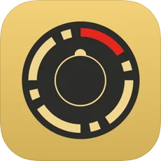 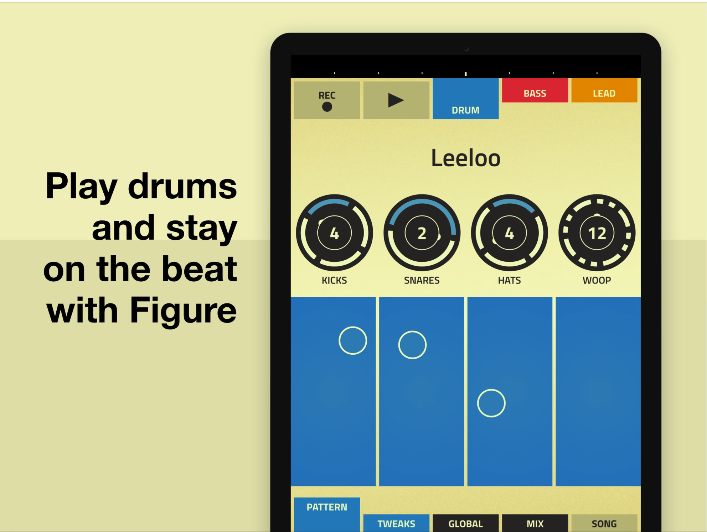

Garage Band - аккорды в тональности 
>**0:59** 
> 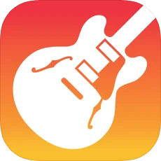 
> 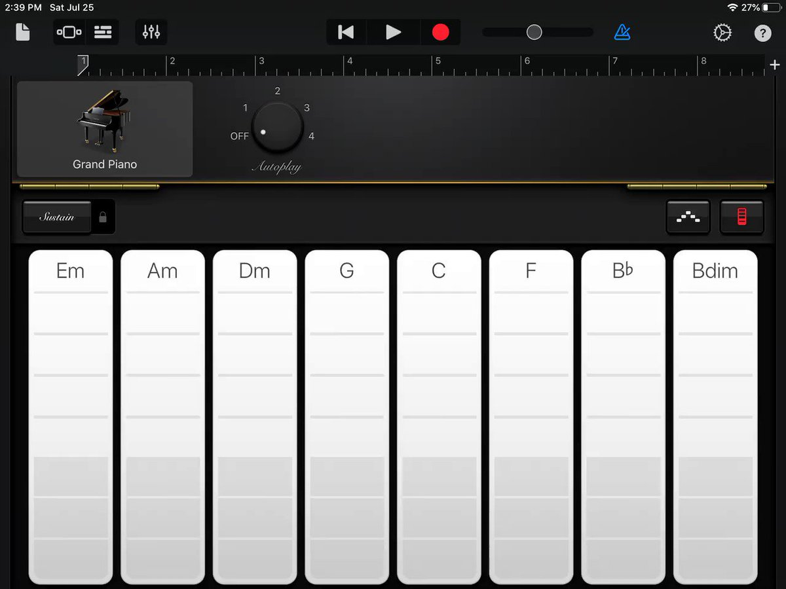 

Chordion 
>**1:18** 
>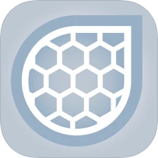 
>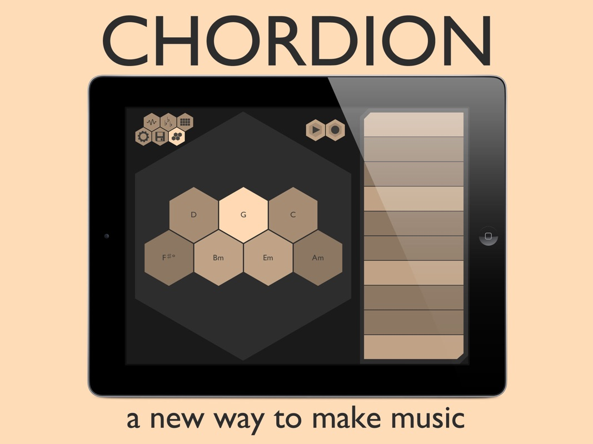

Synth one, AUM

##  Logic Pro X

##  Гитара, укулеле, калимба

##  Аналоговый сетап: 

Корг volca, 
>**2:00** 
>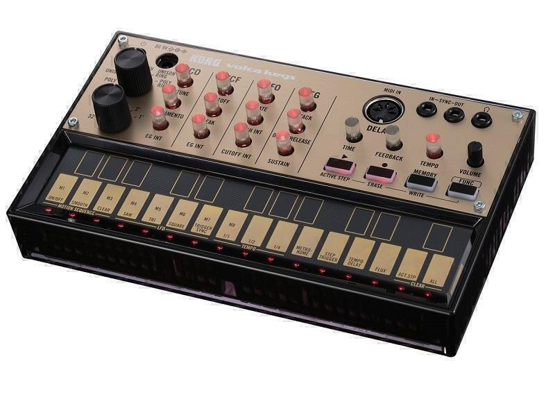

Uno Synth,
>**2:02** 
>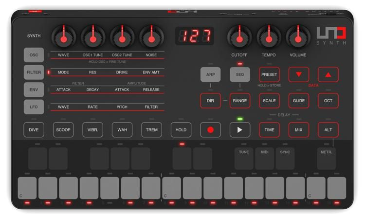

Korg NTS-1 
>**2:04** 
>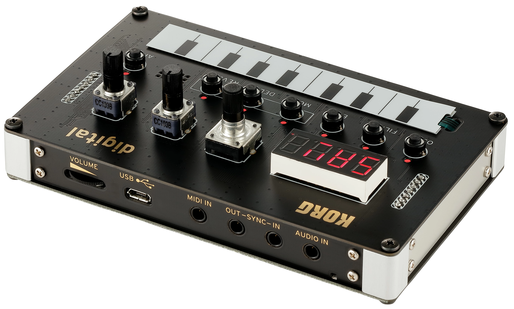

##  Оп1 как универсальный инструмент 
>**3:00** 
>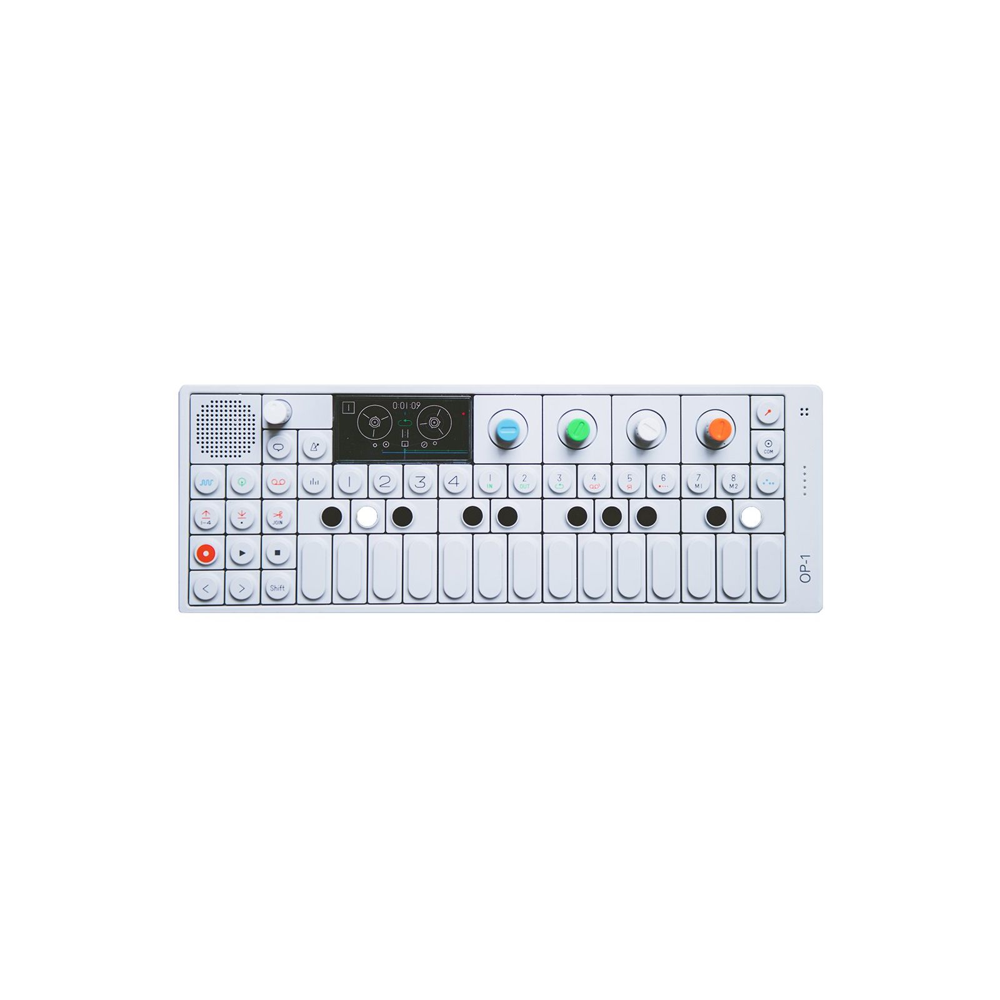

##  Лайвы
##  op-z 
>**3:35** 
>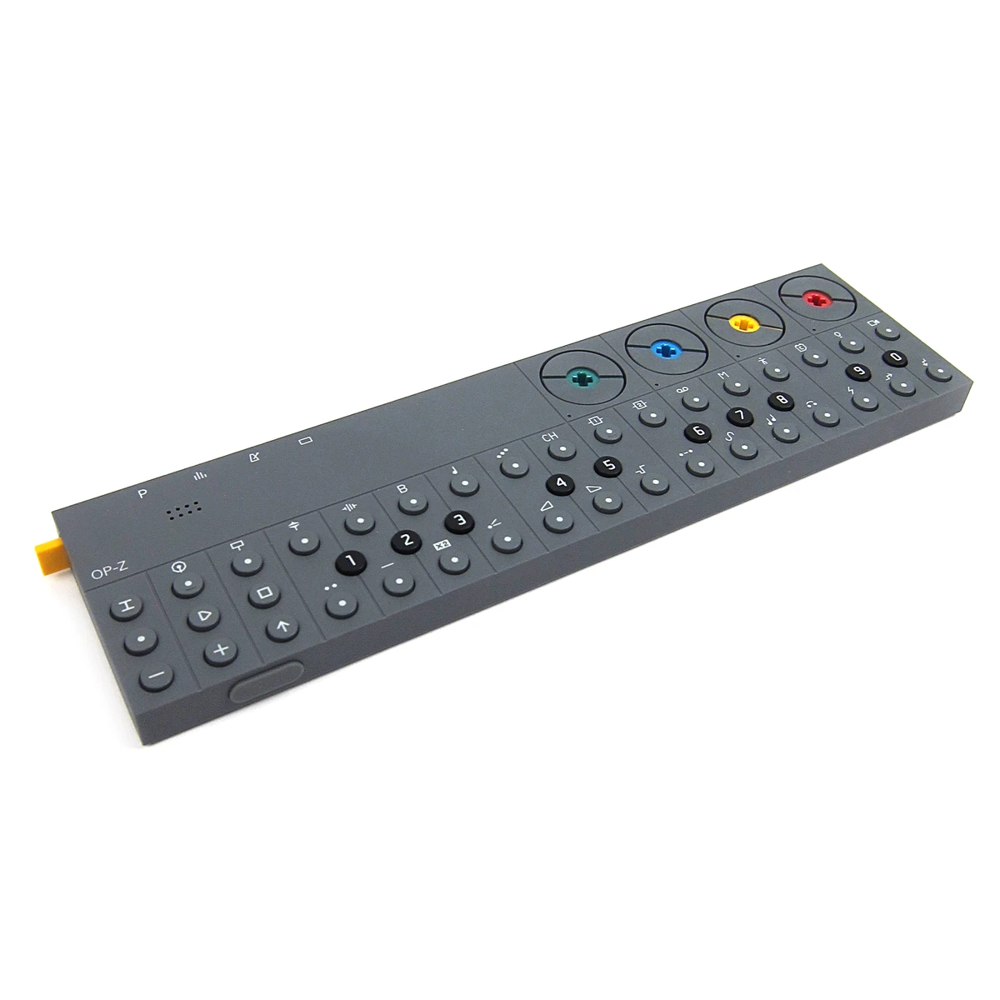

##  Миди клавиатура
##  Оп3 и миди-контроллеры
##  DAW
1.  Ableton Live
2.  Logic Pro
3.  другие