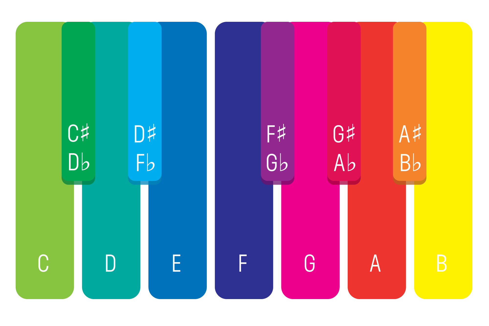

1.  Требования
    1.  12 хроматических нот
    2.  минимум 2 октавы
    3.  Место для наклеек
2.  Подходят:
    1.  Клавишные: пианино, синтезаторы,
    2.  midi-клавиатура и девайс (телефон, планшет, компьютер)
        2.  Web - Google Chrome + [MIDI.city](https://midi.city/)
    3.  Гитара или укулеле
    4.  Калимба, ксилофон, металлофон

### Наклейки
Клавиши 
> **3:42**  
> 
> **6:25** 

3.  Не подходят
    1.  Духовые
    2.  Безладовые
    3.  С нестандартной настройкой
4.  Настройка инструмента
    1.  [InsTuner](https://apps.apple.com/ru/app/instuner-free-chromatic-tuner/id603425027) - iOS
    2.  [Chromatone tuner](https://chromatone.center/practice/pitch/tuner.html) - WEB
    3.  [Chroma tuner](https://play.google.com/store/apps/details?id=cafe.adriel.chroma&hl=en_US&gl=US) - Android