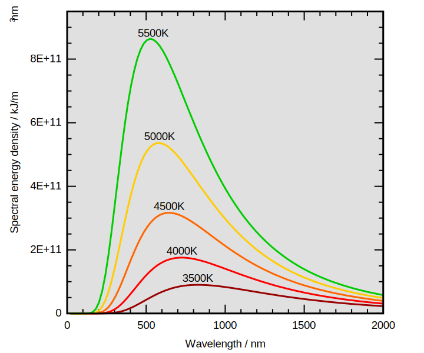

## Электромагнитное поле 
Фундаментальное физическое поле, взаимодействующее с электрически заряженными телами.

Электромагнитное излучение — возмущение электромагнитного поля, распространяющееся в пространстве. 

1.  корпускулярно-волновой дуализм
2.  С точки зрения квантовой электродинамики — поток фотонов - безмассовых частиц - элементарных возбуждений эм поля
	
### Скорость света 

в вакууме = 299 792 458 м/с = 1 079 252 848,8 км/ч **ПОКАЗАТЬ ЦИФРЫ НА ЭКРАНЕ**

1.  Предельная скорость движения частиц и распространения взаимодействий и информации
2.  определяет границы наблюдаемой вселенной
3.  свет, испущенный самыми удалёнными наблюдаемыми объектами вскоре после Большого взрыва, прошёл до нас лишь 13,8 млрд световых лет, что значительно меньше, чем сопутствующее расстояние 46 млрд св. лет (равное текущему собственному расстоянию) до этих объектов, ввиду расширения Вселенной.
4.  До Солнца 8.32 мин
5.  до альфы центавра 4.3 св. года

### [Спектр излучения]
1.  Радиоволны 10км - 1м - огибают препятствия, кривизну Земли 30 кГц — 300 ГГц
	1.  сверхдлинные - 10 Мм - 10 км
		1.  связь с подводными лодками
	2.  длинные - 10 км - 1 км
	3.  средние - 1км - 100 м
	4.  короткие - 100 м - 10 м
	5.  укв - 10 м - 1 см - распространяются по прямой
		1.  метровые
		2.  дециметровые
		3.  сантиметровые
	6.  Атмосферные явления,
	7.  Магнитосферные явления
	8.  любительская радиосвязь
2.  Микроволны 1м - 1 мм - распространяются по прямой
	1.  Радары
	2.  Беспроводные сети, мобильная связь
	3.  бесконтактный нагрев — резонанс с молекулами воды
3.  Инфракрасное излучение 1мм - 780 нм - исходит от нагретых тел - 300 Ггц - 429 ТГц
	1.  Оптическая связь
	2.  Ночное видение
4.  Видимый свет 780-380 нм - 750 ТГц - 3 ПГц
	- 
5.  Ультрафиолет 380 нм - 10 нм
	3.  ближний, А - черный свет - флуоресценция - загар
	4.  средний Б, дальный С и экстремальный
	5.  обеззараживание
6.  Рентгеновское излучение 10 нм - 5 пм
7.  Гамма-лучи короче 5 мм

## Абсолютно черное тело

Абсолю́тно чёрное те́ло — физическое тело, которое при любой температуре поглощает всё падающее на него электромагнитное излучение во всех диапазонах.

## Солнце и его строение

###   Состав
	1.  состоит в основном из водорода (73% массы) и гелия (25% массы)
	2.  На 1 млн атомов водорода приходится 98 000 атомов гелия, 851 атом кислорода, 398 атомов углерода, 123 атома неона, 100 атомов азота, 47 атомов железа, 38 атомов магния, 35 атомов кремния, 16 атомов серы, 4 атома аргона, 3 атома алюминия, по 2 атома никеля, натрия и кальция, а также малое количество прочих элементов. Масса Солнца составляет 99,866 % от суммарной массы всей Солнечной системы

###  Стуктура 

####  ядро
1.  20-25% радиуса -
2.  зона термоядерной реакции -
3.  из 4 протонов образуется гелий-4. - 4
4.  плотность в 150 выше воды, температура —
5.  14 млн. К.
6.  Быстро вращается.
7.  в излучение превращается 4.26 млн тонн вещества в секунду (очень малая доля общей массы и дает относительное невысокое удельное тепловыделение)
####  Зона лучистого переноса
1.  0.25 — 0.7 радиуса от центра
2.  плазма поглощает и переизлучает фотоны
3.  фотоны двигаются к поверхности тысячи лет
4.  температура снижается от 7 до 2 млн К.
5.  плотность — от 20 до 0.2 плотности воды
#### Конвективная зона

1.  Плотность падает и появляется движение
2.  Снизу поднимается нагретая плазма, сверху падает остывшая
3.  температура снижается до 5800К
4.  плотность падает до 1/100 плотности воздуха
5.  один оборот в грануле — за 10-15 минут — время ее жизни.
6.  движение вызывает эффект магнитного динамо и создает сложное магнитное поле Солнца
####  Атмосфера

1.  Фотосфера
    1.  100-400 км толщиной
    2.  темп с 6600 К падает до 4400К
    3.  непрозрачная — поглощает высоко энергетическое излучение и переизлучает видимый свет
2.  Хромосфера
    1.  толщина 2000 км
    2.  полупрозрачная
    3.  красная линия излучения водорода
    4.  разогревается от 4000 до 20000 К
3.  Корона
    1.  
    2.  Разогревается до 20 млн. К
    3.  состоит из протуберанцеви и энергетических извержений
    4.  излучает УФ и рентген

## Cпектр поглощения

1.  Спектральный диапазон электромагнитного излучения Солнца очень широк — от радиоволн до рентгеновских лучей — однако максимум его интенсивности приходится на видимый свет (жёлто-зелёную часть спектра).
2.  На уровне Земли мощность излучения Солнца 1367 Вт/м²
3.  земли достигает 341 Вт/м²
	1.  УФ поглощается озоновым слоем и электростатическим полем, которое зазряжается молниями
	2.  часть ИК поглощается воздухом
	3.  Воздух рассеивает свет
	4.  облака отражают и рассеивают
	5.  60% света отражается обратно в космос
4.  Парниковые газы усиливают поглощение излучения и усиливают нагрев атмосферы

### Освещенность 
Измеряется в люксах = 1люмен/кв.м. == 0.1 кандела
1.  днем летом — 50 000 лк
2.  в пасмурный день — 5000 лк
3.  в комнате у окна — 1000 лк
4.  нужно для чтения — 50 лк
5.  ночью в полнолуние — 0.2лк

###  Другие источники света
1.  Пламя
2.  нить накаливания
3.  газоразрядные трубки
4.  электронно-лучевые трубки
5.  светодиоды
6.  плазменные ячейки