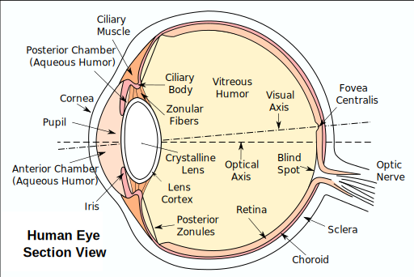
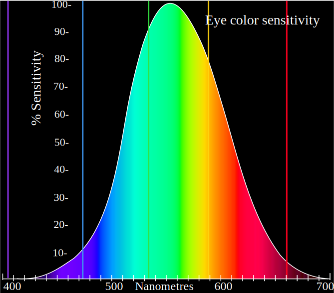
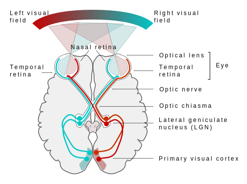

## Что такое цвет
1.  качественная субъективная характеристика электромагнитного излучения оптического диапазона, определяемая на основании возникающего физиологического зрительного ощущения и зависящая от ряда физических, физиологических и психологических факторов.
2.  цвет — это _ощущение_, которое получает человек при попадании ему в глаз световых лучей.
3.  С философской точки зрения цвет — квалиа, невыразимое прямое субъективное переживание.
   
##  Cтроение глаза

###  Три оболочки

1.  Наружная
    1.  роговица
    2.  склера
2.  Средняя
    1.  радужка
    2.  ресничное тело
    3.  сосудистая оболочка
    4.  зрачок
3.  Внутренняя
    1.  сетчатка

###  Путь луча света в глазу

1.  роговица,
2.  передняя камера,
3.  радужка,
4.  зрачок,
5.  задняя камера,
6.  хрусталик
7.  стекловидное тело
8.  сетчатка

##  Строение сетчатки

10 слоев нервных клеток
Глиальные клетки проводят свет к фоточувствительным клеткам

### Палочки - ч.б. сумеречное периферийное зрение

Распределение колбочек и палочек. 

### Колбочки - цветное дневное зрение

Палочки преоблажают на основной площади.

1.  синие,
2.  красные,
3.  зеленые

### 3 уровня нейронов

### Зрительный нерв

Глазные нервы частично перекрещиваются в хиазме, деля зрительное поле между двумя полушариями мозга.

    

## Восприятие цвета может различаться
Неравномерная способность различать цвета 

1.  Разные виды фотопигментов в палочках
2.  Дальтонизм
3.  Синестезия