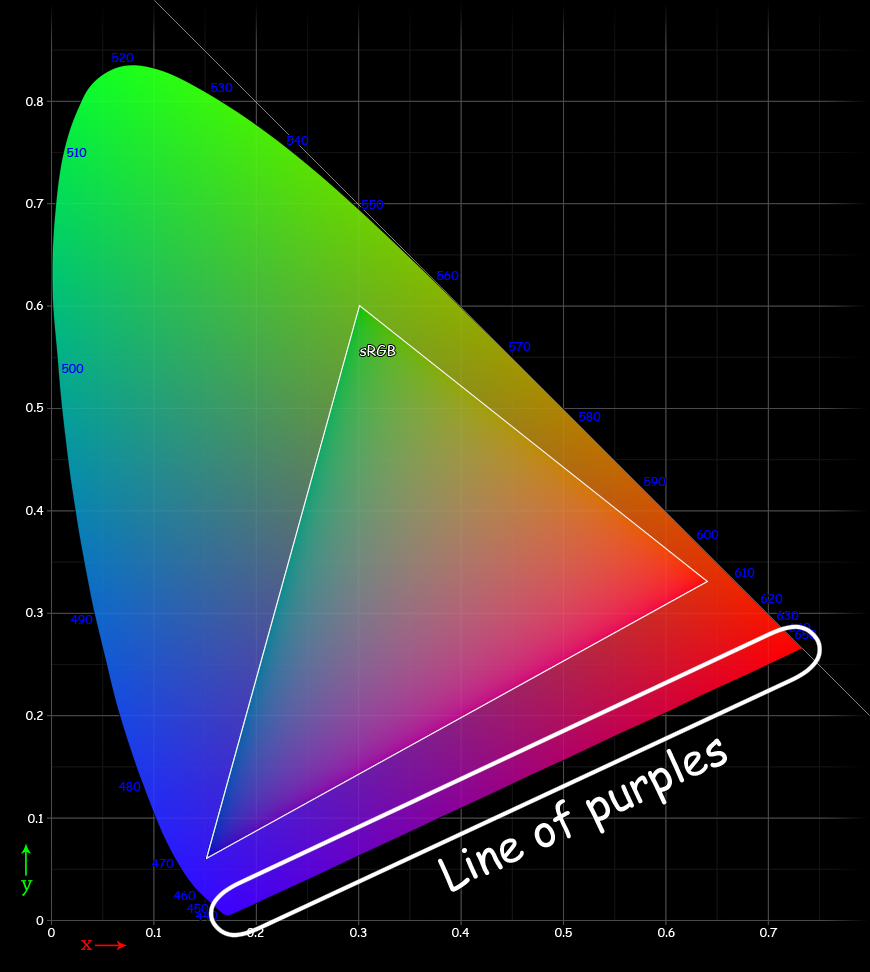
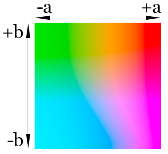

##  Характеристики цвета

1.  Тон
2.  Яркость (светлота)
3.  Насыщенность

##  Цветовая модель
математическая модель описания представления цветов в виде набора чисел, называемых цветовыми компонентами или цветовыми координатами.

### Цветовой круг

Замыкается в круг спектр через смешение красного и фиолетового — линии пурпурных цветов.

### Цветовое пространство

##  Модели
    
### Табличные
Модели, где соответствие цветов задаётся таблично (Цветовая модель Пантон (Pantone), Цвета RAL)

### Субтрактивные модели

#### RYB

#### CMYK

### Аддитивные модели

#### RGB

### Перцептивные

#### LAB

L\*a\*b\*— равноконтрастное цветовое пространство, в котором расстояние между цветами соответствует мере ощущения их различия.

### HSL

- HSL
- Lch
- HSB

###  Практика работы с цветом