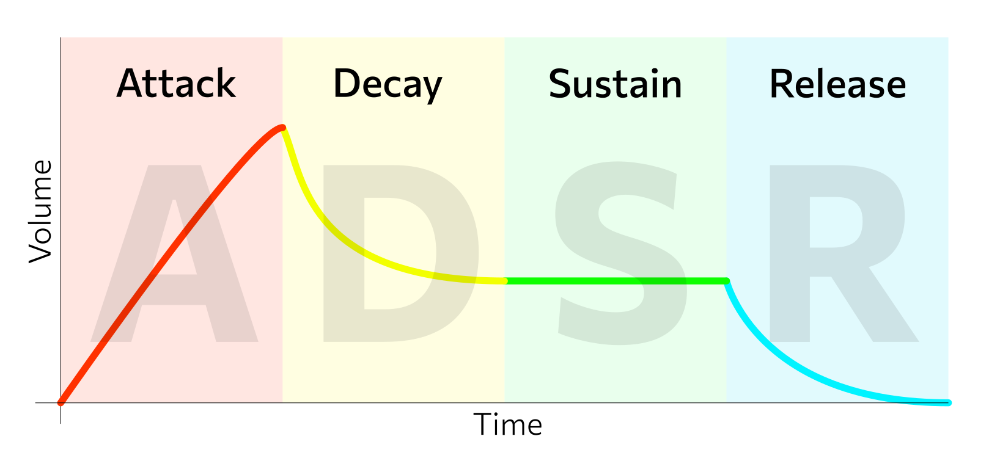
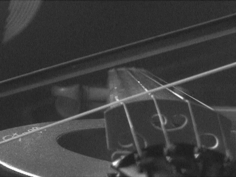
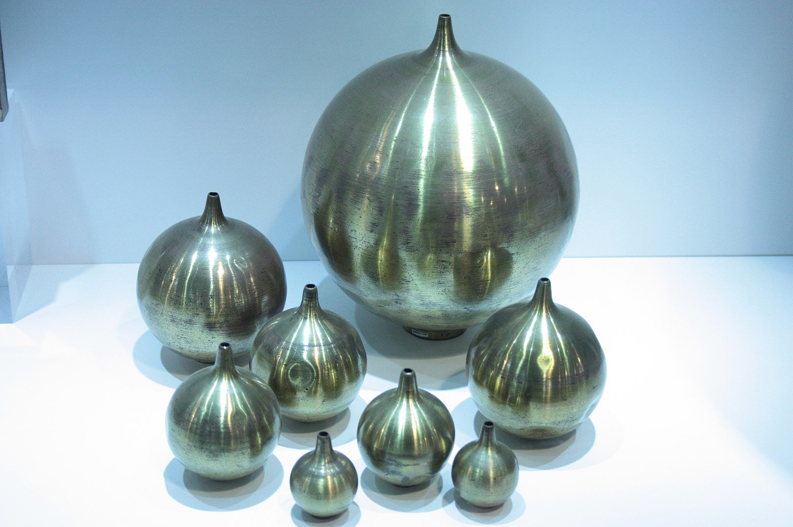

##  Звукообразующая система 
Определяет характер звука, мы его считываем и способны распознавать систему
   
1.  источник энергии - щипок, смычок, удар или поток воздуха
2.  вибрирующее тело - струна, пластина, столб воздуха, голосовые связки
    1.  материал:
        1.  металл, дерево, пластик
        2.  жесткость, твердость, упругость,
    2.  размер, положение в пространстве
3.  резонатор - корпус, форма пластины (колокол), раструб

##  Огибающая

1.  Атака
2.  спад
3.  поддержка
4.  затухание

## Частотный спектр

приглушенный и яркий звук - соотношение высоких и низких частот

###  Шум — любой звук, которой создаётся совокупностью несогласованных между собой источников.
1.  Белый
2.  Розовый
3.  Коричневый

###  Преобразование Фурье
1.  Разложение сложного колебания в ряд синусоид с заданными коэффициентами
2.  Спектрограмма

### Музыкальный тон

#### обертоны
1.  Гармонические - целые гармоники
    1.  Стоячая волна с закрепленными концами
    2.  Кратные основному тону частоты
    3.  флажолеты
    4.  Натуральный звукоряд - отсутствие биений
2.  Негармонические
    1.  не кратны основному тону
    2.  металлические пластины, колокола
    3.  неравномерная толщина

###  резонанс

#### Резонатор Гельмгольца
1.  Бутылка, Джаг [https://youtu.be/ip5gXXHxMaE](https://youtu.be/ip5gXXHxMaE)
2.  точная настройка, возможность слышать частотные составляющие звука
3.  

### Резонаторы в инструментах
- Корпус гитары
- Раструб духовых

#### Голосовой аппарат
1.  вибрирует гортань и бронхи, связки управляют
2.  Форманта
    1.  высокая - D-G - 2400-3200 Гц - звонкость, громкость, полетность
    2.  низкая - G-F - 350-700 Гц - мягкость, массивность
   

###  резонансная теория пения
1.  Бельканто в итальянской опере с конца 16 века.
    1.  Петь, не поколебав пламя свечи
    2.  _«Звук должен быть в носу, но в звуке не должно быть носа»_
    3.  Голос, лишенный резонанса, — мертворожденный и распространяться не может. — Джакомо Лаури-Вольпи
2.  Исследования резонансного пения начаты В. П. Морозовым в 1950-х годах,
3.  _Резонансное пение — это пение с высоким коэффициентом полезного действия (КПД) голосового аппарата на основе использования законов резонанса и психофизиологических средств самоконтроля и усиления резонансных процессов голосообразования_.
4.  В рамках резонансной теории пения впервые выделены и рассматриваются СЕМЬ важнейших функций певческих резонаторов (наряду с известными их функциями):
    1.  _энергетическая_ — как свойство резонаторов усиливать певческий звук на основе повышения КПД голосового аппарата;
    2.  _генераторная_ — резонаторы как неотъемлемая часть общей системы генерации и излучения певческого звука;
    3.  _фонетическая_ — формирование гласных и согласных, дикция;
    4.  _эстетическая_ — обеспечение основных эстетических свойств певческого голоса (звонкость, мягкость, полётность, тип голоса, вибрато);
    5.  _защитная_ — СЕМЬ прямых и опосредованных механизмов защиты гортани и голосовых складок от перегрузок и травмирования. Основные защитные механизмы резонаторов по отношению к гортани состоят в свойстве хорошо организованной системы резонаторов усиливать звук, а также перераспределять его спектр в область повышенной чувствительности слуха, что освобождает певца от необходимости перенапрягать гортань для достижения необходимой громкости голоса. Прямой защитный механизм состоит в сильнейшем обратном (реактивном) воздействии окружающих гортань резонаторов, облегчающем колебательный процесс голосовых складок;
    6.  _индикаторная_ — вибрация резонаторов как индикатор (показатель) их активности и физиологическая основа настройки певцом резонаторной системы по принципу «обратной связи»;
    7.  _активизирующая_ — вибрация резонаторов как рефлекторный механизм повышения тонуса гортани, голосовых складок и всего голосового аппарата в целом (эффект Малютина).