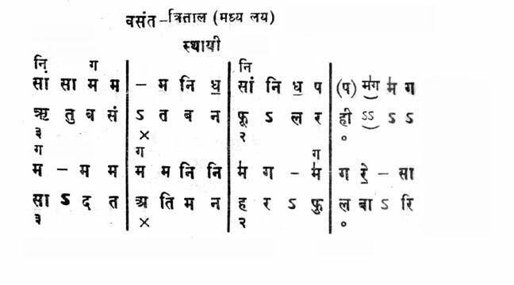
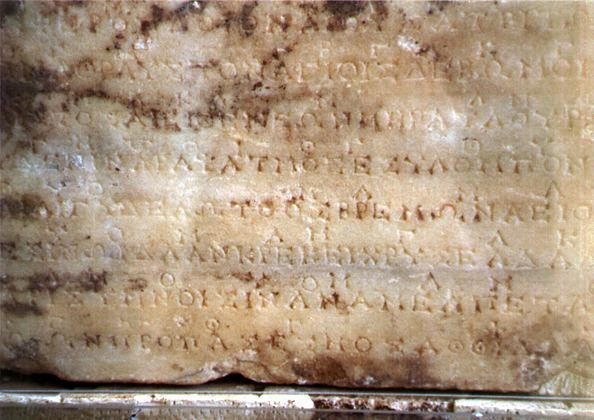

1.  Нота — точка в непрерывном пространстве звуковых частот
2.  Записанная нота обозначает высоту, длительность и порядок исполнения.
3.  в музыке используются наборы из нот
4.  всем известны 7 основных нот:
    1.  как 7 основных цветов радуги
    2.  до, ре, ми, фа, соль, ля, си
5.  Одну и ту же ноту можно обозначить разными способами
6.  В различных регионах мира независимо возникали свои системы нотации
    1.  Устная традиция — песни и эпос
   
## Месопотамия - древнейшие записи инструкций для Хурритских певцов 
- 

## Индия
- 

## Корея - Джеонгганбо
- 
- 

## Япония - Кункунши
-   

## Древняя Греция 
1.  