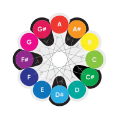

## Первая нота — ля
- Камертон
- 440 Гц

## Первый цвет — красный

## Нота A - красного цвета

### 12 нот - 12 цветов

1 тон с шагом 30 градусов по кругу

## Множество возможных применений:

Раскрасить ноты на нотном стане

  
Цветная гвидонова рука 